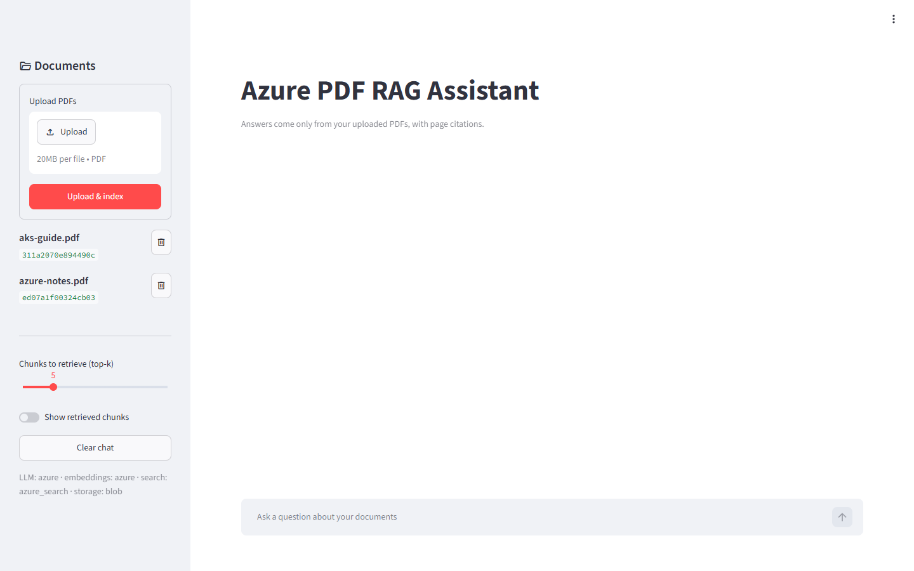
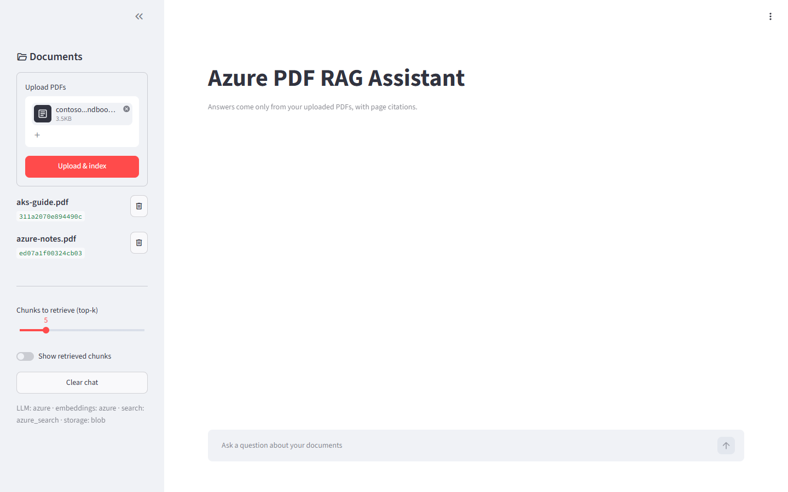
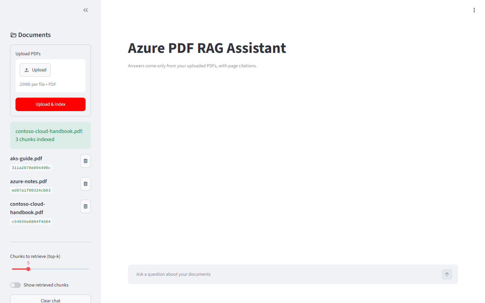
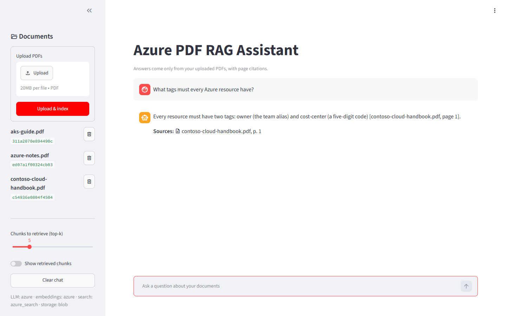
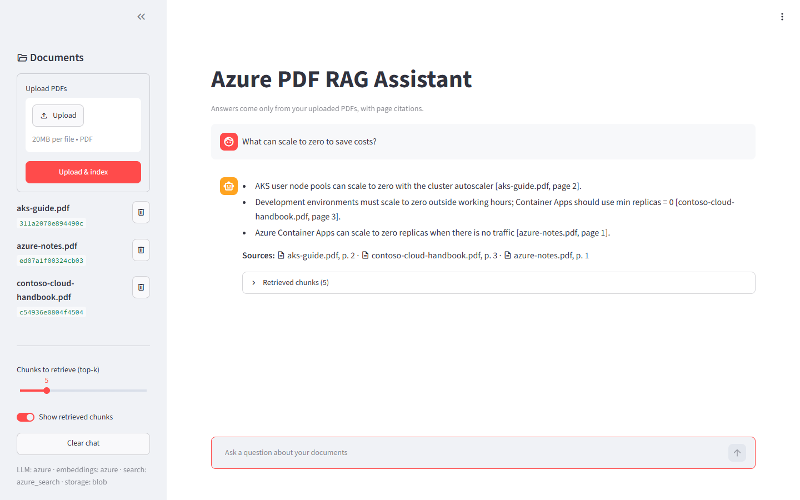
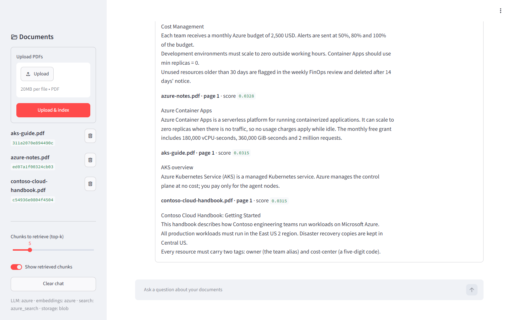
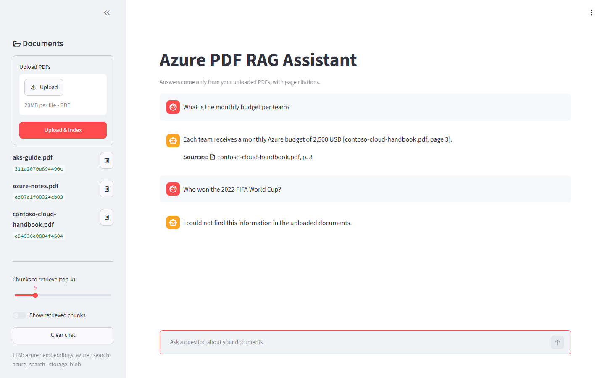
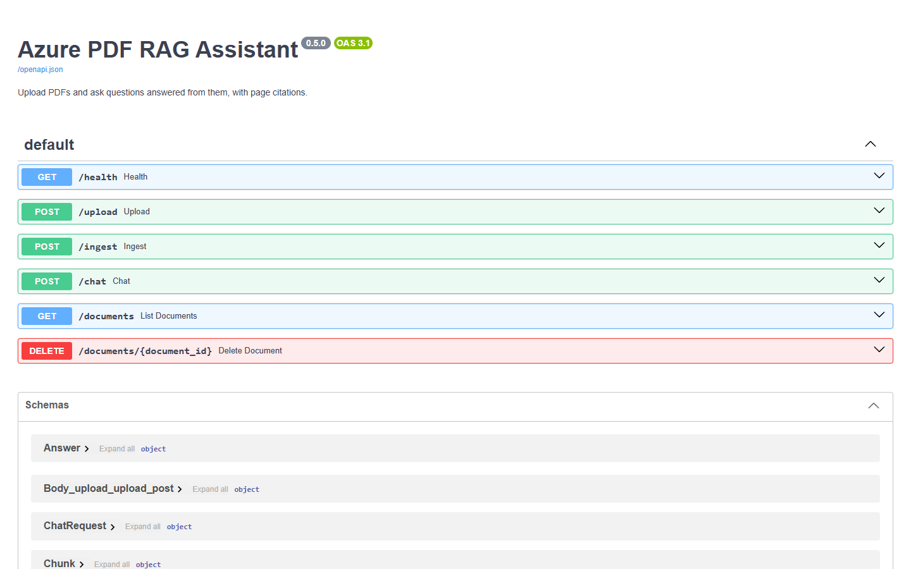
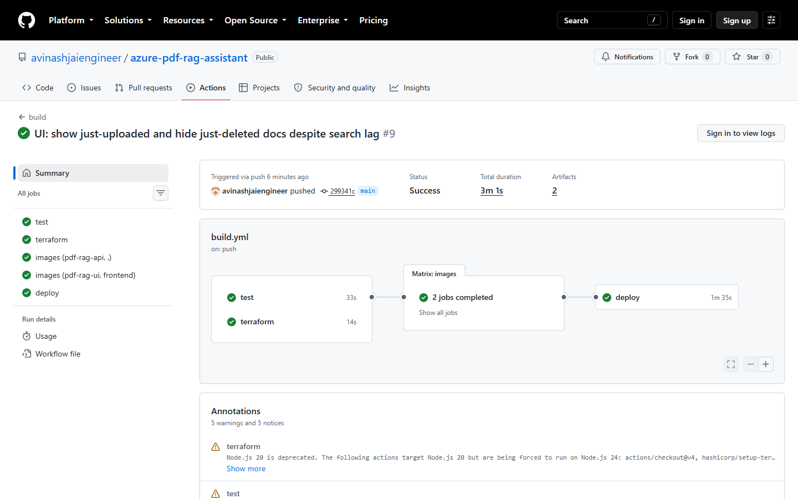

# Azure PDF RAG Assistant

Upload PDFs, ask questions, get answers grounded in the documents with file/page citations.
Built in phases: everything works locally first (Ollama + FAISS), then each component is
swapped for its Azure equivalent by changing configuration, not code.

**Stack:** Azure OpenAI (`gpt-5-mini`, `text-embedding-3-small`) · Azure AI Search (hybrid BM25 + vector) ·
Azure Blob Storage · FastAPI · Streamlit · Azure Container Apps · Terraform · GitHub Actions (OIDC).
No API keys anywhere: every service authenticates with Microsoft Entra ID.

- [Walkthrough: using the app](#walkthrough-using-the-app)
- [Phases](#phases) and how each was built
- [Quick start](#quick-start-phase-1-fully-local-0) to run it yourself

## Walkthrough: using the app

All screenshots are from the deployed app on Azure Container Apps. To follow along, use the sample
PDF in [`docs/sample/contoso-cloud-handbook.pdf`](docs/sample/contoso-cloud-handbook.pdf), a fictional
three-page cloud policy handbook.

### 1. Open the app

The sidebar lists every indexed document and its ID. The footer shows which backends are active:
here, everything runs on Azure (`LLM: azure · embeddings: azure · search: azure_search · storage: blob`).



### 2. Choose a PDF

Click **Upload** in the sidebar and pick one or more PDFs (up to 20 MB each).



### 3. Upload & index

Click **Upload & index**. The API checks the file is a real PDF, extracts text page by page, splits it
into chunks, embeds them with Azure OpenAI, indexes them in Azure AI Search, and stores the original in
Blob Storage. The new document appears in the list straight away.



Rejected uploads never get stored: wrong extension or non-PDF bytes (400), over 20 MB (413), or no
extractable text, such as a scanned PDF (422). Uploading a new version under the same filename replaces
the old one.

### 4. Ask a question

Type a question in the box at the bottom. The answer uses only the uploaded documents and cites the file
and page inline. **Sources** lists the pages the answer actually used.



### 5. Ask across documents

Retrieval searches every document at once, so one answer can combine facts from several PDFs, each
cited to its own page.



### 6. See why it answered that way

Turn on **Show retrieved chunks** to see the exact passages sent to the model, with their hybrid
search scores. **Chunks to retrieve (top-k)** controls how many passages are retrieved (default 5).
Raise it for broad questions; lower it for precise ones.



### 7. It won't make things up

If the documents don't contain the answer, the assistant says so instead of guessing, and shows no
sources.



### 8. Manage documents

- **Delete:** click the bin icon next to a document (visible in step 3). This removes its chunks from
  the search index and the PDF from Blob Storage.
- **Clear chat:** resets the conversation; documents stay indexed.

### For developers: API and pipeline

The UI is a thin client over a REST API. Interactive docs are at `/docs` when the API runs locally
(`uvicorn src.api.main:app`). In Azure the API is internal-only and reachable just from the UI.



Every push to `main` runs tests and Terraform checks, builds both images, pushes them to Azure
Container Registry, and rolls the Container Apps to the new version.



## Phases

| Phase | Scope | Status |
|---|---|---|
| 1 | Local RAG: PyPDF → chunking → Ollama embeddings → FAISS → Ollama LLM, with citations | ✅ Done |
| 2 | Azure OpenAI for chat + embeddings (`LLM_PROVIDER=azure`, `EMBEDDING_PROVIDER=azure`), Entra ID auth | ✅ Done |
| 3 | Azure AI Search with hybrid (keyword + vector) retrieval (`VECTOR_STORE=azure_search`) | ✅ Done |
| 4 | Azure Blob Storage for uploaded PDFs (`DOCUMENT_STORAGE=blob`) | ✅ Done |
| 5 | FastAPI (`/upload`, `/ingest`, `/chat`, `/documents`) + Streamlit UI | ✅ Done |
| 6 | Docker → GitHub Actions → Azure Container Registry → Azure Container Apps (scale to zero) | ✅ Done |
| 7 | Terraform infrastructure + GitHub Actions CI/CD (test → build → deploy) | ✅ Done |

## Architecture (Phase 1)

```
PDF ─► pdf_loader ─► chunker ─► embeddings ─► vector_store (FAISS)
                    (per page)   (Ollama)          │
                                                   ▼
question ─► embed_query ─► retriever ─► top-k chunks ─► generator (Ollama) ─► answer + citations
```

Each backend sits behind a small interface (`Embedder`, `VectorStore`, `Generator`) with a
`get_*()` factory driven by `src/config/settings.py`. Later phases add implementations;
the pipeline, scripts, and tests stay the same.

## Quick start (Phase 1, fully local, $0)

Prerequisites: Python 3.12, [Ollama](https://ollama.com) running locally.

```powershell
ollama pull qwen3:8b
ollama pull nomic-embed-text

python -m venv .venv
.\.venv\Scripts\Activate.ps1
pip install -r requirements-dev.txt
copy .env.example .env

# Put PDFs in data\raw\, then:
python -m scripts.ingest                  # index every PDF in storage (data\raw\ or Blob)
python -m scripts.ingest my.pdf           # upload to storage, then index
python -m scripts.ingest --list           # show indexed documents
python -m scripts.ask "What is AKS?"      # one question
python -m scripts.ask -v                  # interactive, shows retrieved chunks + scores
python -m pytest                          # tests (no Ollama needed)
```

Re-ingesting the same file replaces its chunks (document IDs are content hashes).
If you change the embedding model within a provider, delete `data\processed\faiss\<provider>\` and re-ingest.

## Phase 2: Azure OpenAI

Authentication uses `DefaultAzureCredential`: your `az login` session locally, managed identity
once deployed. Key auth is disabled on the resource, so there are no secrets to leak.

One-time setup (Azure CLI; in Git Bash prefix role commands with `MSYS_NO_PATHCONV=1`):

```bash
RG=rg-pdf-rag-dev; LOC=eastus2; NAME=aoai-pdfrag-<suffix>
az provider register -n Microsoft.CognitiveServices --wait
az group create -n $RG -l $LOC
az cognitiveservices account create -n $NAME -g $RG -l $LOC --kind OpenAI --sku S0 --custom-domain $NAME --yes
az resource update -g $RG -n $NAME --resource-type Microsoft.CognitiveServices/accounts --set properties.disableLocalAuth=true
az cognitiveservices account deployment create -g $RG -n $NAME --deployment-name gpt-5-mini   --model-name gpt-5-mini --model-version 2025-08-07 --model-format OpenAI --sku-name GlobalStandard --sku-capacity 50
az cognitiveservices account deployment create -g $RG -n $NAME --deployment-name text-embedding-3-small   --model-name text-embedding-3-small --model-version 1 --model-format OpenAI --sku-name Standard --sku-capacity 120
az role assignment create --assignee-object-id $(az ad signed-in-user show --query id -o tsv)   --assignee-principal-type User --role "Cognitive Services OpenAI User"   --scope $(az cognitiveservices account show -g $RG -n $NAME --query id -o tsv)
```

Then set `AZURE_OPENAI_ENDPOINT`, `LLM_PROVIDER=azure`, `EMBEDDING_PROVIDER=azure` in `.env` and re-run
`python -m scripts.ingest`. Each embedding provider gets its own index under `data/processed/faiss/<provider>/`,
so you can switch back to Ollama at any time without re-ingesting.

Notes:
- `gpt-4o-mini` can no longer be newly deployed (deprecated 2026-03-31); `gpt-5-mini` is the cheap replacement.
- `gpt-5-mini` is a reasoning model: it takes `reasoning_effort` instead of `temperature`. `minimal` occasionally
  refused answerable questions in testing, so the default is `low`.
- Model deployments have no standing cost; you pay per token. The Free Trial spending limit caps spend at your credit.

## Phase 3: Azure AI Search

`VECTOR_STORE=azure_search` swaps FAISS for Azure AI Search (Free tier). Queries are **hybrid**: BM25 keyword
search plus HNSW vector search, fused with Reciprocal Rank Fusion. That's why scores look like `0.0333`
(≈ 1/61 + 1/61 for a chunk ranked first in both lists) rather than cosine similarities.

The index (`pdf-chunks-<embedding_provider>`) is created on first ingest, sized to the real embedding dimension.
Fields mirror the `Chunk` model: `id`, `document_id`, `filename`, `page_number`, `chunk_id`, `content`,
`content_vector`. The vector field is searchable but not stored, which roughly halves vector storage on the
50 MB free tier.

One-time setup (Free tier: one per subscription; if a region reports `InsufficientResourcesAvailable`, try another):

```bash
export MSYS_NO_PATHCONV=1   # Git Bash only
RG=rg-pdf-rag-dev; NAME=srch-pdfrag-<suffix>
az provider register -n Microsoft.Search --wait
az search service create -n $NAME -g $RG -l eastus --sku free   --auth-options aadOrApiKey --aad-auth-failure-mode http401WithBearerChallenge
SCOPE=$(az search service show -n $NAME -g $RG --query id -o tsv)
ME=$(az ad signed-in-user show --query id -o tsv)
az role assignment create --assignee-object-id $ME --assignee-principal-type User --role "Search Service Contributor" --scope $SCOPE
az role assignment create --assignee-object-id $ME --assignee-principal-type User --role "Search Index Data Contributor" --scope $SCOPE
```

Then set `AZURE_SEARCH_ENDPOINT` and `VECTOR_STORE=azure_search` in `.env` and run `python -m scripts.ingest`.

## Phase 4: Azure Blob Storage

`DOCUMENT_STORAGE=blob` keeps the original PDFs in a Blob container instead of `data/raw/`. Ingestion always
goes upload -> storage -> read back -> index, so storage holds the source of truth for everything indexed:

- `python -m scripts.ingest a.pdf` uploads `a.pdf`, then indexes it.
- `python -m scripts.ingest` re-indexes every PDF in the container (e.g. after changing chunk size).
- `python -m scripts.ingest --delete <id>` removes the chunks from the index **and** the blob.
- Uploading a changed file under the same name replaces the old version's chunks.

The storage account has shared-key access and public blob access disabled; Entra ID is the only way in.

```bash
export MSYS_NO_PATHCONV=1   # Git Bash only
RG=rg-pdf-rag-dev; SA=stpdfrag<suffix>
az provider register -n Microsoft.Storage --wait
az storage account create -n $SA -g $RG -l eastus2 --sku Standard_LRS --kind StorageV2 --access-tier Hot   --allow-blob-public-access false --allow-shared-key-access false --min-tls-version TLS1_2 --https-only true
az storage container-rm create --storage-account $SA -g $RG -n documents --public-access off
az role assignment create --assignee-object-id $(az ad signed-in-user show --query id -o tsv)   --assignee-principal-type User --role "Storage Blob Data Contributor"   --scope $(az storage account show -n $SA -g $RG --query id -o tsv)
```

Then set `AZURE_STORAGE_ACCOUNT_URL` and `DOCUMENT_STORAGE=blob` in `.env`.

Local runs spend ~1 s per Azure service fetching an `az login` token; all clients share one credential so
the chain is only probed once. Deployed with managed identity (Phase 6), token fetches are near-instant.

## Phase 5: FastAPI + Streamlit

```powershell
uvicorn src.api.main:app --reload            # API on http://localhost:8000 (docs at /docs)
streamlit run frontend/app.py                # UI on http://localhost:8501 (API_URL env to point elsewhere)
```

| Method | Path | Purpose |
|---|---|---|
| GET | `/health` | Status + which backends are active |
| POST | `/upload` | Multipart PDF → validate → index → store. Returns `document_id`, `chunks` |
| POST | `/ingest?filename=` | Re-index one stored PDF, or all if omitted |
| POST | `/chat` | `{"question": "...", "top_k": 5}` → answer, citations, retrieved chunks |
| GET | `/documents` | Indexed documents |
| DELETE | `/documents/{id}` | Remove from index and storage |

Uploads are rejected (and never stored) if the name isn't `.pdf` (400), the bytes aren't a PDF (400), the file
exceeds `MAX_UPLOAD_MB` (413), or it can't be parsed / has no extractable text (422). The PDF is indexed before
it is stored, and the index entry is rolled back if storing fails, so index and storage stay in sync.

The UI only talks to the API over HTTP, so the two can be deployed as separate containers in Phase 6.

## Phase 6: Containers on Azure Container Apps

```
git push ──► GitHub Actions: pytest ──► build 2 images ──► ACR (tag = commit SHA)
                                   (OIDC, no secrets)          │
                                                               ▼
Internet ──► ca-pdfrag-ui (Streamlit, external, IP-allowlisted) ──► ca-pdfrag-api (FastAPI, internal only)
                                                                         │ managed identity
                                                         ┌───────────────┼───────────────┐
                                                    Azure OpenAI     AI Search      Blob Storage
```

- **Two images**: `Dockerfile` (API) and `frontend/Dockerfile` (UI), both non-root `python:3.12-slim`.
- **Builds run in GitHub Actions** (`.github/workflows/build.yml`), because ACR Tasks (`az acr build`) are
  blocked on Free Trial subscriptions. Actions logs in to Azure with OIDC: an Entra app (`gh-pdfrag-ci`)
  with a federated credential for this repo's `main` branch and only `AcrPush` on the registry. Note that
  GitHub now issues subjects with immutable IDs (`repo:owner@<id>/repo@<id>:ref:refs/heads/main`).
- **Deploy** happens in CI on every push to `main` (Phase 7). `bash scripts/deploy.sh` is a manual
  fallback that rolls both apps to an existing tag, e.g. `TAG=<older-sha>` to roll back.
- **No secrets anywhere**: both apps run as a user-assigned managed identity (`id-pdfrag-<suffix>`) with
  `AcrPull`, `Cognitive Services OpenAI User`, `Search Index Data Contributor`, `Search Service Contributor`
  and `Storage Blob Data Contributor`. `AZURE_CLIENT_ID` tells `DefaultAzureCredential` which identity to use.
- **Network**: the API has internal ingress (unreachable from the internet); the UI calls it at
  `http://ca-pdfrag-api`. The UI is restricted to the IPs in Terraform's `ui_allowed_cidrs`.
- **Cost**: both apps scale 0-1 replicas, so idle costs nothing beyond the Container Apps free grant.
  ACR Basic is ~$5/month. The first request after idle has a cold start of a few seconds.
- AI Search is near-real-time: a deleted document can still be listed for about a second.

`docker-compose.yml` runs both containers locally in fully-local mode (Ollama + FAISS), for machines with Docker.

## Phase 7: Terraform + CI/CD

Everything from Phases 2-6 was first created with `az` and then **adopted into Terraform with `import`
blocks** (26 resources, 0 replaced). The import blocks were removed afterwards; `terraform plan` shows no drift.

```
infrastructure/terraform/
  providers.tf   azurerm 4.x + azuread 3.x, remote state in Azure Storage (Entra ID auth)
  variables.tf   suffix, regions, model deployments, GitHub OIDC subject, developer IDs, UI allow-list
  main.tf        RG, OpenAI + deployments, AI Search, Storage, ACR, identity, Log Analytics, Container Apps
  iam.tf         role assignments for the app identity, developers, and the CI identity; CI Entra app + OIDC
  outputs.tf     UI URL, client IDs, endpoints for a local .env
```

**State** lives in `rg-pdf-rag-tfstate/sttfstate487f` (versioned, 14-day soft delete, no shared keys), separate
from the app resource group so destroying one can't destroy the other. One-time bootstrap:

```bash
az group create -n rg-pdf-rag-tfstate -l eastus2
az storage account create -n sttfstate487f -g rg-pdf-rag-tfstate -l eastus2 --sku Standard_LRS   --allow-blob-public-access false --allow-shared-key-access false --min-tls-version TLS1_2
az storage account blob-service-properties update -n sttfstate487f -g rg-pdf-rag-tfstate   --enable-versioning true --enable-delete-retention true --delete-retention-days 14
az storage container-rm create --storage-account sttfstate487f -g rg-pdf-rag-tfstate -n tfstate
# + Storage Blob Data Contributor on that account for whoever runs terraform
```

Day to day:

```bash
cd infrastructure/terraform
terraform init
terraform plan     # review
terraform apply
```

**Who changes what:**

| Change | Owner |
|---|---|
| Resources, roles, env vars, scaling, IP allow-list | Terraform (run by a developer) |
| Container image tag | CI `deploy` job (Terraform ignores `image`) |

Terraform runs locally rather than in CI on purpose: managing role assignments needs Owner-level rights,
and the CI identity deliberately has only `AcrPush` + `Container Apps Contributor` on the two apps.

**Pipeline** (`.github/workflows/build.yml`):

```
PR:          test ─┬─ terraform fmt/validate
push main:   test ─┴─ terraform fmt/validate ──► build+push images (tag = SHA) ──► roll API, UI ──► wait until ready
```

## Project layout

```
src/
  config/settings.py      # all settings, read from .env
  models/schemas.py       # PageText, Chunk, RetrievedChunk, Answer, Citation
  azure_clients/          # Azure SDK code: shared credential, OpenAI, AI Search, Blob (Entra ID auth)
  ingestion/              # pdf_loader, chunker, storage (local/Blob), processor (ingest_document)
  rag/                    # embeddings, vector_store, retriever, generator, pipeline
  api/                    # FastAPI app (main.py), routes, Services container
frontend/app.py           # Streamlit UI
scripts/                  # ingest.py, ask.py (CLI), deploy.sh (manual roll/rollback)
infrastructure/terraform/ # all Azure infrastructure (Phase 7)
Dockerfile, frontend/Dockerfile, docker-compose.yml
.github/workflows/build.yml  # test, terraform checks, build + push images, deploy (OIDC)
tests/                    # chunking, pipeline, AI Search, storage, API tests (all offline, with fakes)
data/raw, data/processed  # local PDFs and FAISS index (git-ignored)
```

## Cost notes

Phase 1 uses no cloud resources. From Phase 2 on, keep the corpus small (a handful of PDFs),
use Azure AI Search's free tier, set Container Apps `min replicas = 0`, and delete resource
groups you are not using. Azure OpenAI usage is billed against your credit, not a free quota.
